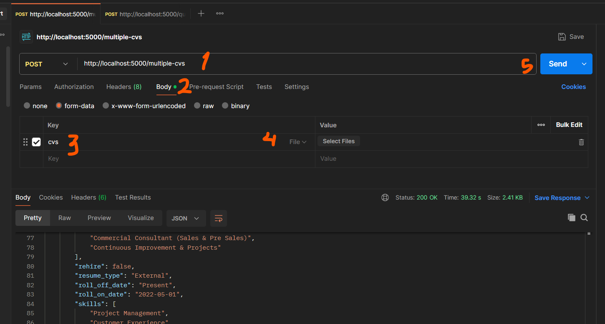

# Flask | PDF Chat Backend Application

This project is created as a learning exercise, utilizing **LangChain** and **Flask**. The application allows you to upload a PDF file and get a match against provided roles, using the OpenAI API as the LLM Provider.

## Installation

Follow these steps to set up and run the project in your local environment:

### Step 1: Clone the Repository

```bash
git clone https://github.com/your_username/your_repository_name.git
cd your_repository_name
```

### Step 2: Install Chocolatey (Windows only)
You can install Chocolatey by following the instructions on the [Chocolatey installation page](https://chocolatey.org/install). Or you can simply follow these instructions:
1. Open PowerShell as Administrator.
2. Execute the following command:

```bash
Set-ExecutionPolicy Bypass -Scope Process -Force; [System.Net.ServicePointManager]::SecurityProtocol = [System.Net.ServicePointManager]::SecurityProtocol -bor 3072; iex ((New-Object System.Net.WebClient).DownloadString('https://community.chocolatey.org/install.ps1'))
```

### Step 3: Install Redis

#### For Windows:
Install Redis using Chocolatey
1. Open PowerShell as Administrator.
2. Execute the following command:
```bash
choco install redis
```

#### For Mac:
Install Redis using Homebrew
1. Open Terminal.
2. Execute the following command:
```bash
brew install redis
```

### Step 4: Install Pipenv Globally

```bash
pip install pipenv
```

### Step 5: Open your proyect to install dependencies and activate the virtual environment with Pipenv

```bash
pipenv shell
pipenv install
```

## Usage

### Modify you .env
1. Clone the ``.env.example`` file and rename the copy to ``.env``.
2. Open the ``.env`` file and paste your OpenAI API Key into the file. It should look like this:
```bash
OPENAI_API_KEY=openai-api-key
REDIS_HOST=localhost 
REDIS_PORT=6379 
REDIS_DB=0
AZURE_SEARCH_ENDPOINT=azure-search-endpoint
AZURE_SEARCH_API_KEY=azure-api-key
AZURE_SEARCH_INDEX_NAME=azure-index-name
DOWNLOAD_PATH="C:\\Users\\user_name\\Downloads\\"
```

### Run the application

Run this command inside your project (where you ran ``pipenv shell``)

```bash
python app.py
```

### Manage Redis Server

Start Server
```bash
redis-server
```

Verify Server
```bash
redis-cli ping
```

Check Redis Database
```bash
redis-cli scan 0
```

Stop Server
```bash
redis-cli shutdown
```

### Scan your PDF using Postman or a similar tool
1. Create a POST request to http://localhost:5000/multiple-cvs.
2. Click on the Body tab.
3. Click on "form-data" and add a field named "cvs" 
4. Select "File" from the dropdown and then "Select Files" to upload your CVs
5. Click on "Send" and let it happen!

